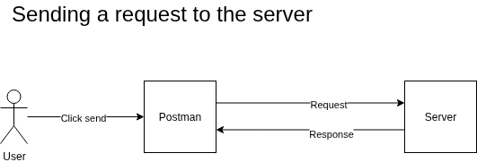

# 1. Overview
Postman is a tool used to send requests to APIs and explore how services respond. It support multiple protocols. 

- **HTTP/HTTPS**: Standard protocol for RESTful APIs and web services
- **GraphQL**: Supported for both HTTP/HTTPS queries and subscriptions.
- **gRPC**: Full support including native understanding of .proto files.
- **WebSocket**: Enables real-time, bidirectional communication.
- **MQTT**: Standard messaging protocol for IoT systems.
- **SOAP**: Traditional protocol used for exchanging structured information.
- **MCP**: Full support for interacting with AI models, agents, and servers.

# 2. Purpose
Postman enables users to test, document, and analyze APIs through an intuitive interface. Before tools like Postman existed, developers had to write custom code to test APIs, which made the process slower and more complex.

# 3. Business Value

- Intuitively and easily test APIs
- Better APIs quality
- More secure APIs 

# 4. Key Concepts
| Concept | Description |
|---------|-------------|
| API | The part of an application that receives your request and sends back a response. |  
| Request and response model | An API works like a simple exchange: you send a request to a server, and the server replies with a response. Postman lets you build the request and inspect the response.
| Server | A computer that receives requests and sends back responses. |
| Request | A message sent to a server’s address (URL) asking it to perform an action. |
| Response | The message the server returns in answer to a request. |
| Environment | APIs are often deployed in multiple environments (development, staging, production). Using environments in Postman helps you test safely and avoid sending requests to production by mistake. |
| Variables | A variable is a box where you store a value that can be reused in your requests. Each environment has its own set of variables, such as the API’s development URL. |
| Collection | A collection groups related requests together. It helps you organize your work and reuse requests as you test an API. |
| Workspace | A workspace groups related collection together.  It helps you organize your projects and collaborate with colleagues as you build and test APIs. |
| Authentification | Some APIs restrict access and require authentication. You must prove your identity before sending requests, which helps prevent misuse. |
| Authorization | Some APIs restrict access and require authentification and authorization. You must prove your identity and the authorization to access the endpoints, which helps prevent misuse. |

# 5. Core Features

| Feature | Description |
|---------|-------------|
| Send request | Postman let you send request to an API. |
| Receive response | You can read and understand the response send back by the API. |
| Reuse and organize your requests with collection | Create a map of the APIs endpoints. It facilitate further testing and analysis. |
| Team collaboration within a workspace | Enable real time collaboration in the same workspace. |
| Authentify to an API with multiple security scheme | Able to test an API protected with authentification. |
| Authorize ourselves to an API | Able to test an API/endpoints protected with authorization. |

# 6. How It Works (Conceptual)
Explain the logic or flow **without technical details**.

```
[User] → [Action] → [System Behavior] → [Outcome]
```

# 7. Typical Use Cases
| Use Case | Description |
|----------|-------------|
| Testing API endpoints during development| Send requests to compare the expected response against the actual response. |
| Analyzing API behaviors when developping | Send requests and analyze the response to learn how the API behave. |
| Testing API authentification and authorization | You try to authentify to your API. To make sure it's well protected and accessible. |
| Analyzing an API behaviors when developping | Who benefits from it |

# 8. Benefits
| Benefit | Description |
|---------|-------------|
| Easier to test API | 	Frees cognitive energy to focus on improving the API. |
| Faster debugging | Gives you more time to actually improve the API. |
| Less technical knowledge required | Non‑technical users can become proficient quickly. |
| Built‑in API documentation | Every request you create in a collection becomes part of the API’s living documentation.|
| Improved collaboration | Shareable collections let everyone contribute easily. |
| Higher resusability of works  | Collections, environments, and auth setups are saved and reusable. |

# 9. Limitations
- A minimum conceptual knowledge is needed to use Postman.

# 10. Visual Example


# 11. Glossary
| Term | Definition |
|------|------------|
| Cognitive | Related to thinking, understanding, or mental effort. |
| Protocol | A set of rules governing the exchange or transmission of data between devices. |
| Authentification | Authentication is the process of verifying the identity of a user, device, or system before granting access to resources. |
| Authorization | Authorization is a critical security process that determines what resources a user can access and what actions they can perform within a system, following successful authentication. |

# 12. Notes
> **Note:** Add any important clarifications here.

# 13. Revision History
| Version | Date | Author | Changes |
|---------|------|--------|---------|
| 1.0.0   | 2026-05-31 | Marc-André | Initial version |
